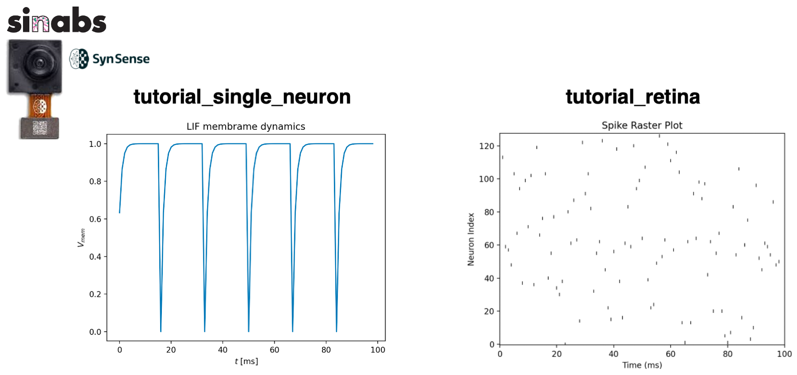

# Foveated Vision

This library uses [Sinabs](https://sinabs.readthedocs.io/en/v2.0.0/) and Leaky Integrate-and-Fire (LIF) 
neurons to simulate a foveated or uniform retina. 
You'll find tutorial on how to use LIF from sinabs library and scripts to learn how to use the [Speck](https://www.synsense.ai/products/speck-2/) device. 

The goal is to create receptive fields that mimic the human retina, where the size
of the receptive fields increases from the fovea (center) to the periphery. 
The library can be used to simulate various
visual processing tasks with biologically inspired models of vision.

## Tutorials

- [tutorial_single_neuron](https://github.com/GiuliaDAngelo/foveated-vision/blob/main/tutorials/tutorial_single_neuron.py)
- [tutorial_retina](https://github.com/GiuliaDAngelo/foveated-vision/blob/main/tutorials/tutorialretina.py)
- [tutorial_create_eccentric_retina](https://github.com/GiuliaDAngelo/foveated-vision/blob/main/tutorials/tutorial_create_eccentric_retina.py)
- [tutorialSpeckVisualiser](https://github.com/GiuliaDAngelo/foveated-vision/blob/main/tutorials/tutorialSpeckVisualiser.py)
- [tutorial_Speck_events](https://github.com/GiuliaDAngelo/foveated-vision/blob/main/tutorials/tutorial_Speck_events.py)

## Let's start! 

- ### Create single LIF neuron in sinabs

[tutorial_single_neuron](https://github.com/GiuliaDAngelo/foveated-vision/blob/main/tutorials/tutorial_single_neuron.py)

You will learn how to create a single LIF, inject it with current and plot the membrane potential and spikes.
This script simulates the membrane potential dynamics of a single neuron using the Sinabs library. 
A neuron is injected with a constant input, and its membrane potential is tracked over time. 
If the neuron spikes, the spike is recorded. Finally, the membrane potential is plotted to visualize the dynamics.

- ### Retina raster plot

[tutorial_retina](https://github.com/GiuliaDAngelo/foveated-vision/blob/main/tutorials/tutorialretina.py)

You will learn how to create a retina, 128x128 receptive fields and plot the raster plot.
This script simulates receptive fields (RFs) in a retina using a 2D grid of Leaky Integrate-and-Fire (LIF) neurons. 
It generates a Poisson-distributed spike train and processes it through the neurons, 
visualizing spike activity and membrane potential dynamics. Configurations like tau_mem, grid size, 
and others are set in an external config file, while helper functions manage plotting and utilities.

- ### Create human-like retina

[tutorial_create_eccentric_retina](https://github.com/GiuliaDAngelo/foveated-vision/blob/main/tutorials/tutorial_create_eccentric_retina.py)

You will create a retina with eccentric receptive fields, 128x128 receptive fields and plot the raster plot.
The eccentric receptive fields are created by using the `eccentricity` parameters in the `create_eccentric_RFs()` function.
The parameters are in helpers/config.py file.
In this script you will also plot the eccentric structure and the Look Up Table (LUT) of the receptive fields.
The LUT will be created so that it'll speed up the process of finding the receptive field of a given neuron.

References: [Chessa, M., Maiello, G., Bex, P. J., & Solari, F. (2016). A space-variant model for motion interpretation across the visual field. Journal of vision, 16(2), 12-12.](https://jov.arvojournals.org/article.aspx?articleid=2498961)

- ### Spikes from the human-like retina

[tutorial_eccentric_retina](https://github.com/GiuliaDAngelo/foveated-vision/blob/main/tutorials/tutorial_eccentric_retina.py)

This script simulates retinal spiking activity using Poisson-distributed spike trains. 
Neurons are arranged in eccentric receptive fields, where spike events are mapped to random (x, y) coordinates. 
Spikes trigger neuron activity, visualized in real-time as a heatmap, with membrane potential tracked. 
Finally, the spike activity is saved as a GIF showing how it evolves over time.

- ### Speck visualiser

[tutorialSpeckVisualiser](https://github.com/GiuliaDAngelo/foveated-vision/blob/main/tutorials/tutorialSpeckVisualiser.py)

Time to connect your Speck to your computer and visualise the output of the sensor!

This script sets up a visualization pipeline for events from a DVS (Dynamic Vision Sensor) integrated
into the Speck neuromorphic device using the Sinabs backend and Samna libraries to interface with a neuromorphic device like Dynap-CNN. 
It configures the device, streams events to a visualizer, and manages the event graph for
live visualization of DVS activity in a 128x128 resolution plot.
The visualizer is launched in a separate process, and the event data is streamed to it via a TCP port.

- ### Sink events from Speck and visualise them

[tutorial_Speck_events](https://github.com/GiuliaDAngelo/foveated-vision/blob/main/tutorials/tutorial_Speck_events.py)

Now that you know how to visualise the events with the visualiser, let's create a visualiser to look at the events directly from your code. 
This script streams and visualizes events from a Dynamic Vision Sensor (DVS) in real time. 
It uses a background thread to fetch and filter events from a connected device, displaying the events in a window. 
Events are dropped based on a predefined rate, and the visualization is updated at regular intervals.

- ### Run attention on Speck 

This script streams events from a Dynamic Vision Sensor (DVS) integrated on the Speck and processes them through a spiking convolutional neural network using von Mises filters.
It fetches events in real-time, applies the network to generate a saliency map, and visualizes both the events and saliency using OpenCV. 
The von Mises filters are initialized for attention modeling, and a background thread manages event collection.

- References: [D’Angelo, Giulia, et al. "Event driven bio-inspired attentive system for the iCub humanoid robot on SpiNNaker." Neuromorphic Computing and Engineering 2.2 (2022): 024008](https://iopscience.iop.org/article/10.1088/2634-4386/ac6b50/meta)

## Installation
Have a look at the [requirements.txt](https://github.com/GiuliaDAngelo/foveated-vision/blob/main/requirements.txt) file to see the dependencies.

### Features:
- **Foveated Receptive Fields**: These fields allow for a more detailed visual representation at the center (fovea), while progressively coarser representation occurs as you move towards the periphery. This mimics the behavior of the human visual system.
- **Leaky Integrate-and-Fire Neurons**: These neurons are implemented using the Sinabs library's LIF model, which captures the spiking dynamics essential for neuromorphic computing.
  
### Components:
- **Retina Layer**: This module creates a foveated retina where the receptive field size changes according to the distance from the center. You can adjust the density of neurons and their activation patterns.
- **Spiking Neural Network (SNN) Processing**: The input from the retina is processed by a spiking neural network using LIF neurons. The Sinabs library provides the underlying infrastructure for creating and training these networks.

